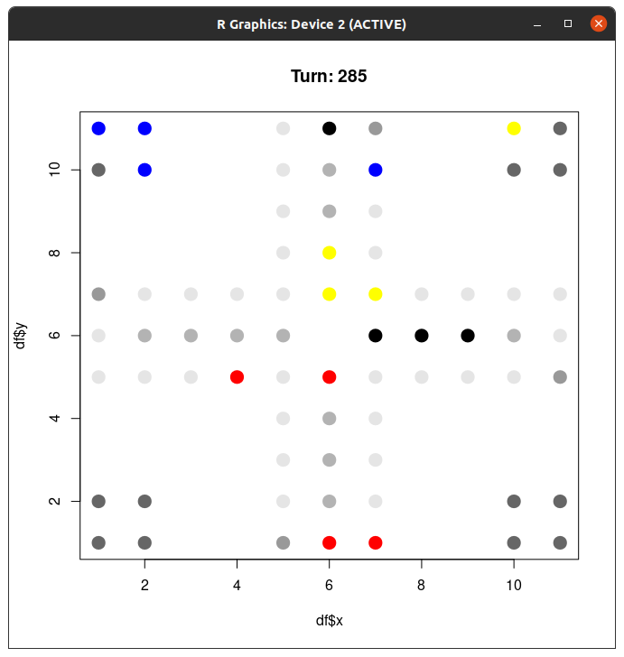

# gamesimulation v0.1.0

This is a simulation of the game '*Mensch ärger dich nicht*'. Similar games are Ludo and Pachisi.

I had this idea for a while now, but never got around to do it. After a game of '*Mensch ärger dich nicht*' during the last vacation, I decided to finally code a small simulation about the game.

## Similar attempts

A quick search yielded, that I am not the only one who did this. Some examples are:
- https://github.com/ixLikro/java-fx-ludoSimulation
- http://www.xdobry.de/maedn/index.html

Since this is one of the games, where everybody has their own house rules, I dont even try to be complete with all the rules, just some we play with.

## Used rules

This is a list of rules, that I used for my simulation:

#### **Rausschmeißpflicht** or kick them all!

If you have the chance to kick some other player home... you have to do it. Most often followed by an angry stare or even cursing of the kicked player and the sentence "I don't want to... but I have to..." - it's a nice excuse!

#### Pulverfass freimachen or keep the start clean

As long as there are [meeples](https://en.wikipedia.org/wiki/Glossary_of_board_games#M) in your start area, you need to keep your start filed free as soon as you can.

#### Dreimal würfeln or the number of retries

When you have all meeples in your starting area or at home with not free spaces between them, then you can roll the dice three times to try and get a six.
(this is is not yet implemented with the home rule, but i want to do it soon... at the moment, you got the retries, when you have no running meeple on the field.)

## Used stategies

At the moment there are only 'first' and 'last' as global strategies implemented. This means the player will always move the first / last available meeple with a few exceptions. When possible:

1) free your start field
2) kick someone
3) move within or into your home area
4) move first / last meeple on the field 

## TODOs :game_die:

- no overjumping at home
- heatmap field for kicking
- test different strategies
- make strategies by players not global
- make a nicer UI
- refactor code (I was on vacation :P )